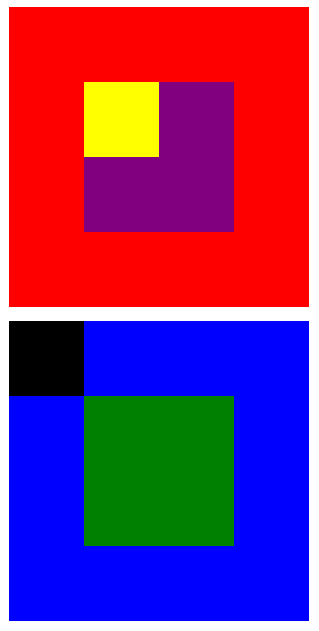

# POSICIONANDO CAJAS.

- Realizar la réplica de las  imágenes mostradas debajo, poniendo en práctica ciertos conocimientos de positioning

## Objetivos:

- Aprender sobre positioning.

- Comprender cada una de las propiedades y/o de positioning.

- Saber emplear las propiedades y/o valores de positioning.

### Imagen:

